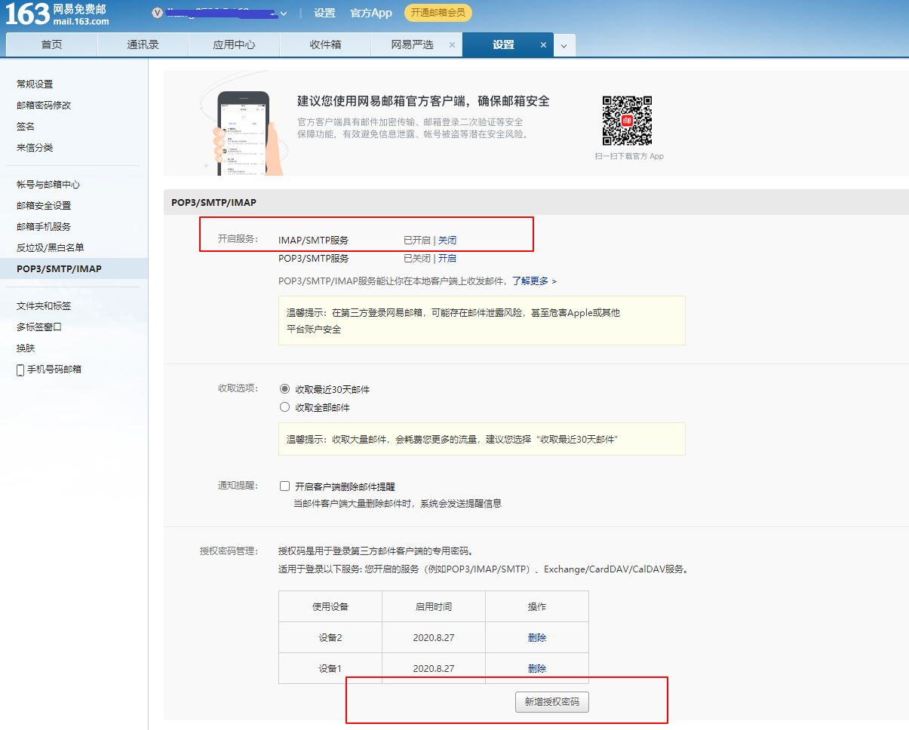
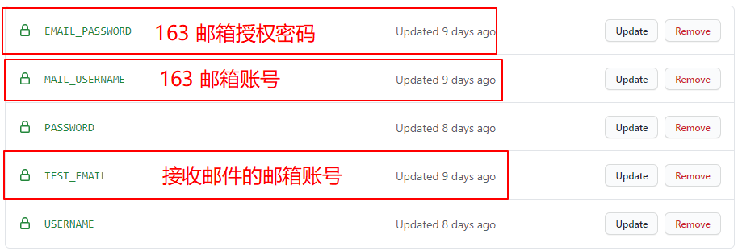
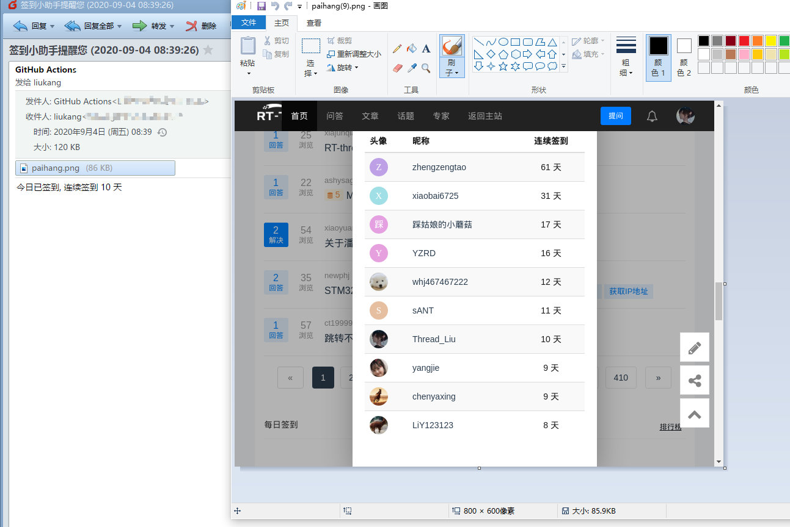
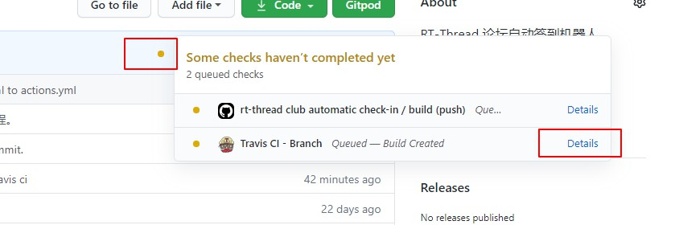
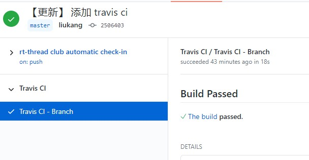
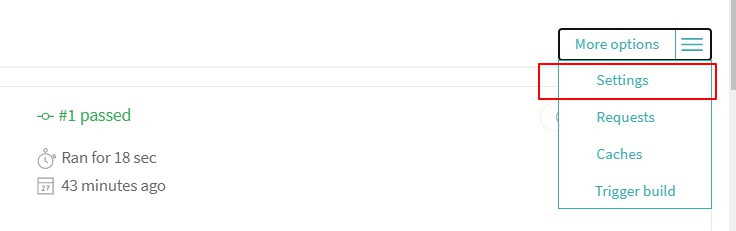
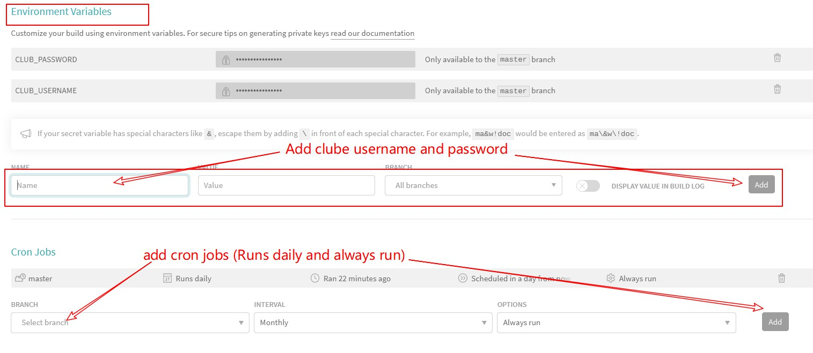

# 使用教程

## 简介

论坛签到需要每天手动去签到，可能某天有事情忘记签到，之前连续签到的记录就没了。基于这种状况，自动化签到脚本就诞生啦。该 CI 脚本会在每天 UTC 00:00，国内时间 8 点左右自动执行，实现机器人自动签到，无论风吹雨打，只要地球不毁灭，签到永不止步！

- fork 本仓库到你的仓库

- 点击 Settings 设置 Secrets，如下图所示：

  

- 点击 Actions 创建工作流


- 创建 yml 文件

  

- 上面的 yml 文件是自动创建的 yml，不是我们需要的，我们需要的 yml 文件已经创建完成，所以需要删除自动生成的 yml 文件。

  

- 一个工作流就已经创建完成，点击 actions 就可以看到所有的 Ations

  

- 查看工作流的具体信息，点击一个工作流，`rt-thread club automatic check-in` 为例：

  

- 点击 build，点击右边的小箭头就可以查看运行信息，可以看到已经成功签到。

  

## 邮件服务

邮件服务会在签到完成后发送邮件到你的邮箱，效果图如下所示：


### 邮件

### 开通邮件服务

- 没有 163 邮箱的请注册 163 邮箱账号，我们将使用 网易 163 邮件的[免费发送服务](http://help.163.com/09/1223/14/5R7P3QI100753VB8.html)。

- 打开 163 邮箱，点击设置，开启 IMAP 服务，新增授权密码，保存好授权密码。

  

- 打开仓库，添加邮箱 secrets:

  

- 邮件服务就开通完毕了，每天 CI 运行完毕，会发送邮件到你的邮箱，会显示签到天数，以及附件今日排行榜。

  

### 关闭邮件服务

打开 actions.yml 文件，删除下面代码：

```c
    - name: Send email
      uses: dawidd6/action-send-mail@master
      with:
        server_address: smtp.163.com
        server_port: 465
        username: ${{ secrets.MAIL_USERNAME }}
        password: ${{ secrets.EMAIL_PASSWORD }}
        subject: 签到小助手提醒您 (${{env.REPORT_DATE}})
        body: ${{env.CLUB_DAY_NUMERS}}
        to: ${{ secrets.TEST_EMAIL }}
        from: GitHub Actions
        content_type: text/html
        attachments: /home/runner/paihang.png
```

## Travis CI

添加 Travis CI 定时任务，防止 Github 服务器抽风忘记签到。

- **fork** 最新的仓库；

- 打开 **Travis CI** 工作流：

  

- 查看 **build** 信息，点击 **The build**：

  

- 点击 setting ，添加环境变量：

  

- 添加环境变量和定时任务：

  
  

## Star 趋势

[](https://starchart.cc/thread-liu/rt-thread-club.svg)
